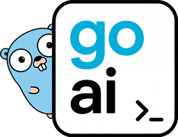
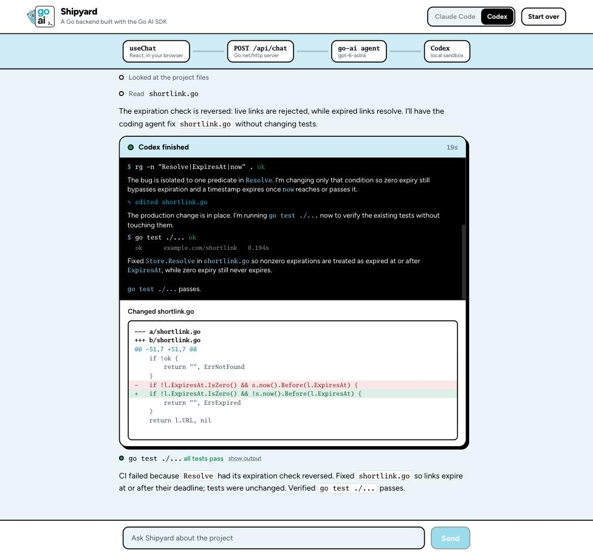
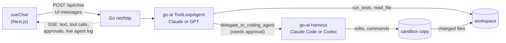

<div align="center">
  
  <h1>Shipyard</h1>
  <p><strong>Tell it what's broken. It finds the cause, asks before changing anything, and has Claude Code or Codex make the fix while you watch.</strong></p>
</div>

<p align="center">
  
</p>

## What it does

Shipyard is a chat app that fixes a failing Go project.

1. **You describe the problem** in plain language, for example "CI is red on shortlink, find out why and fix it."
2. **It investigates.** Shipyard runs the tests and reads the code to find the cause, and tells you what it found.
3. **It asks before changing anything.** When it knows what to change, it shows you the exact task it wants to hand off, with Approve and Deny buttons.
4. **A coding agent makes the fix.** After you approve, Claude Code or Codex edits a sandbox copy of the project. Its commands and edits stream into the chat as they happen.
5. **It checks the result.** The changes come back as a diff, Shipyard reruns the tests, and it tells you what was wrong and what changed.

A toggle in the header picks the **pairing**: **Claude Code** with an Anthropic chat model, or **Codex** with an OpenAI chat model. The steps are the same for both.

## Why it exists

Shipyard is the reference app for the [Go AI SDK](https://goaisdk.com) ([go-ai](https://github.com/digitallysavvy/go-ai)). It shows four go-ai patterns you can copy:

- **A React chat UI on a Go backend.** The browser uses the stock `useChat` hook from `@ai-sdk/react`. The Go server speaks the same streaming protocol as a TypeScript AI SDK backend, so the frontend is stock `useChat`.
- **An agent with tools.** A go-ai `ToolLoopAgent` investigates with `run_tests`, `list_files` and `read_file`, and streams every step.
- **Human approval for risky tools.** `delegate_to_coding_agent` requires approval. The server signs each approval request and checks the signature on your answer, so the browser can't forge one.
- **Coding agents from Go.** The go-ai harness runs Claude Code or Codex in a sandbox, streams their activity into the chat, and reads the changed files back.

## How the pieces fit



## Run it

You need Go 1.26+, Node.js 20.9+, pnpm and git, plus an Anthropic or OpenAI API key (or both).

```bash
git clone https://github.com/digitallysavvy/go-ai-shipyard
cd go-ai-shipyard
make setup          # creates .env and installs the web app
$EDITOR .env        # add ANTHROPIC_API_KEY and/or OPENAI_API_KEY
make dev            # Go server on :8080, web app on :3000
```

Open http://localhost:3000 and click the suggested prompt.

The first coding-agent run per pairing takes a minute or more while the harness installs the Claude Code or Codex bridge into the sandbox. Later runs start in a few seconds.

## Code tour

The developer docs start at [docs/README.md](docs/README.md). AI coding tools working on this repo should read [AGENTS.md](AGENTS.md) first.

| File | What it does |
| --- | --- |
| [`server/chat.go`](server/chat.go) | `POST /api/chat`. Validates `useChat`'s UI messages, runs the agent, and streams UI message chunks back. |
| [`server/tools.go`](server/tools.go) | The agent's tools: `run_tests`, `list_files`, `read_file`, and `delegate_to_coding_agent`, which needs approval. |
| [`server/coder.go`](server/coder.go) | Runs Claude Code or Codex through the go-ai harness, streams its activity as a `data-coder` part, and syncs changes back. |
| [`server/workspace.go`](server/workspace.go) | The project the agents work on, reset from [`workspace-template/`](workspace-template). |
| [`web/app/page.tsx`](web/app/page.tsx) | The chat: `useChat`, the pairing toggle, and the request pipeline in the header. |
| [`web/components/ToolPart.tsx`](web/components/ToolPart.tsx) | Tool calls, approval cards, and the coding-agent card. |

The chat endpoint in `server/chat.go` is built from this:

```go
chunks, _ := ai.CreateUIMessageStreamWithOptions(ctx, ai.UIMessageStreamOptions{
	Execute: func(writer ai.UIMessageStreamWriter) {
		shipyard := agent.NewToolLoopAgent(agent.AgentConfig{
			Model:                          model, // Anthropic or OpenAI
			System:                         systemPrompt,
			Tools:                          s.tools(req.Agent, writer),
			StopWhen:                       []ai.StopCondition{ai.IsStepCount(12)},
			ExperimentalToolApprovalSecret: s.cfg.ApprovalSecret,
		})
		stream, _, err := agent.CreateAgentUIStreamFromUIMessages(ctx, shipyard,
			agent.CreateAgentUIStreamFromUIMessagesOptions{UIMessages: []byte(req.Messages)})
		if err != nil {
			writer.Write(ai.UIMessageChunk{"type": "error", "errorText": err.Error()})
			return
		}
		writer.Merge(stream)
	},
})
ai.PipeUIMessageChunksToResponse(chunks, w, nil)
```

- **Approvals.** `delegate_to_coding_agent` sets `ToolApproval: true`, so the agent stops and sends a signed `tool-approval-request` instead of running it. `useChat` shows it; `addToolApprovalResponse` plus `sendAutomaticallyWhen: lastAssistantMessageIsCompleteWithApprovalResponses` sends your answer back, and `CreateAgentUIStreamFromUIMessages` resumes the agent with it.
- **Live progress.** The tool gets the request's stream writer and writes a `data-coder` part with the tool call ID as its `id`, so each update replaces the last one in the UI instead of piling up.
- **The coding agent.** `harness.NewAgent` with `claudecode.New` or `codex.New` and the local sandbox provider. `SandboxConfig.OnSession` seeds the sandbox with the workspace, and the changed files are read back through the sandbox API when the run ends.

## Recording the demo

- Use a 1440×900 browser window. The header pipeline lights up each hop as data moves through it: browser, Go server, agent, coding agent.
- Do one warm-up run per pairing first, so the bridge install doesn't show up in the take.
- **Start over** resets the project to its failing state between takes.
- To show the switch, record the same prompt once with **Claude Code** and once with **Codex**.

## Configuration

Set these in `.env`. See [`.env.example`](.env.example) for the full list.

| Variable | Default | Purpose |
| --- | --- | --- |
| `ANTHROPIC_API_KEY` | | Enables Claude Code and the Anthropic chat model |
| `OPENAI_API_KEY` | | Enables Codex and the OpenAI chat model |
| `CLAUDE_CHAT_MODEL` | `claude-sonnet-5-5` | Chat model when Claude Code is selected |
| `CLAUDE_CODE_MODEL` | `claude-sonnet-5-5` | Model Claude Code uses |
| `OPENAI_CHAT_MODEL` | `gpt-6-astra` | Chat model when Codex is selected |
| `CODEX_MODEL` | Codex default | Model Codex uses |
| `TOOL_APPROVAL_SECRET` | random per process | Signs approval requests; set it to keep approvals valid across restarts |

## Safety

The coding agent runs with the go-ai **local** sandbox provider: it works in a copy of the project under `.data/sandboxes/`, but commands run as your user on your machine, with your network access. That's fine for this demo's small sample project. For anything else, swap in an isolated sandbox such as the go-ai Vercel Sandbox provider (`pkg/harness/sandbox/vercel`).

## License

Apache 2.0. See [LICENSE](LICENSE). The Go Mono font in `web/app/fonts` is by Bigelow & Holmes, under the [Go fonts license](web/app/fonts/GO-FONTS-LICENSE.txt).

Go is a trademark of Google. The Go gopher, whenever used, is an original creation by Renée French.
