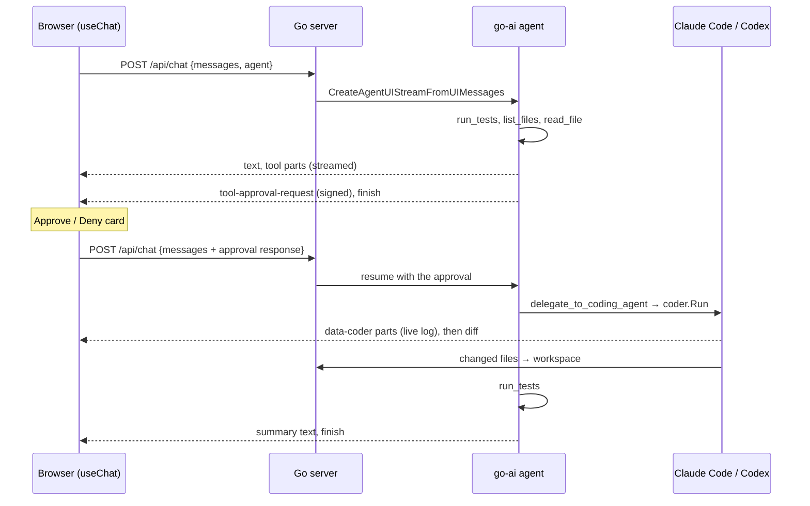

# Architecture

**Summary.** One user request takes two HTTP round trips. In the first, the agent investigates and stops at a tool call that needs approval. The browser shows Approve and Deny. In the second, `useChat` sends the user's decision back, the server runs the approved tool, which drives Claude Code or Codex in a sandbox, and the agent finishes. Everything streams to the browser as AI SDK UI message chunks over Server-Sent Events.

## Components

| Piece | Where | Job |
| --- | --- | --- |
| Chat page | `web/app/page.tsx` | `useChat` with `DefaultChatTransport`; sends `{ id, messages, agent }` to `POST /api/chat`; renders messages |
| Chat endpoint | `server/chat.go` (`handleChat`) | Builds the agent for the chosen pairing, runs it on the UI messages, streams UI chunks back |
| Agent | `agent.NewToolLoopAgent` in `handleChat` | Chat model (Anthropic or OpenAI) plus four tools, stops after 12 steps |
| Tools | `server/tools.go` (`tools`) | `run_tests`, `list_files`, `read_file`, and the approval-gated `delegate_to_coding_agent` |
| Coding-agent runner | `server/coder.go` (`coder`, `Run`) | Creates a harness session, seeds the sandbox, streams activity as `data-coder` parts, syncs changes back |
| Workspace | `server/workspace.go` (`workspace`) | The sample project on disk at `.data/workspace`, reset from `workspace-template/` |

## One request, step by step

1. **Turn 1.** `handleChat` decodes the body, picks the chat model with `chatModel`, and calls `ai.CreateUIMessageStreamWithOptions`. Inside `Execute`, it builds the agent and calls `agent.CreateAgentUIStreamFromUIMessages`, which validates the browser's messages, converts them to model messages and runs the agent. The agent's stream is merged into the response with `writer.Merge`.
2. **Approval request.** The model calls `delegate_to_coding_agent`. The tool has `ToolApproval: true`, so the agent does not run it. It emits a `tool-approval-request` chunk signed with `ExperimentalToolApprovalSecret` and ends the turn.
3. **The browser decides.** `ToolPart` renders the approval card. Approve or Deny calls `addToolApprovalResponse`. `sendAutomaticallyWhen: lastAssistantMessageIsCompleteWithApprovalResponses` resends the conversation.
4. **Turn 2.** The same endpoint runs again. Validation sees the approval response and checks its signature, then the agent runs the approved tool before calling the model.
5. **The coding agent works.** The tool calls `coder.Run`, which streams the harness's events into the chat as a `data-coder` part. When the agent finishes, the changed files are copied back into the workspace and the tool returns the summary and diff.
6. **Wrap-up.** The model calls `run_tests` to verify and writes a short summary.

If the user denies, the tool result is a denial, the model explains that nothing changed, and the coding agent never starts.

## Where state lives

| State | Lives in | Lifetime |
| --- | --- | --- |
| Conversation | The browser (`useChat`), sent in full on every request | Until **Start over** or reload |
| The project being fixed | `.data/workspace` on the server | Until `POST /api/reset`, **Start over** or a server restart |
| Coding-agent sandbox | `.data/sandboxes/<session>` | One `coder.Run` call; destroyed when it returns |
| Approval signing key | `config.ApprovalSecret` | Server process, or fixed via `TOOL_APPROVAL_SECRET` |

The server keeps no per-user session, so any request can go to any instance. One workspace is shared, and `coder` runs one coding session at a time (`coder.mu`).

## Design choices

- **The stock `useChat` frontend, unchanged.** The server speaks the AI SDK UI message stream protocol, so the web app is ordinary AI SDK code.
- **The agent never edits code itself.** It investigates with read-only tools and delegates the change, which keeps the approval point meaningful.
- **Progress as a data part.** Go tools can't stream partial results, so `coder.Run` writes a `data-coder` part through the request's stream writer, reusing the tool call ID as the part ID. Each write replaces the last one in the UI. See [protocol.md](protocol.md#the-data-coder-part).
- **Files sync through the sandbox API.** The runner seeds and reads back files with `SandboxSession` calls instead of host paths, so the same code works with a remote sandbox.

Next: [server.md](server.md) or [web.md](web.md).
