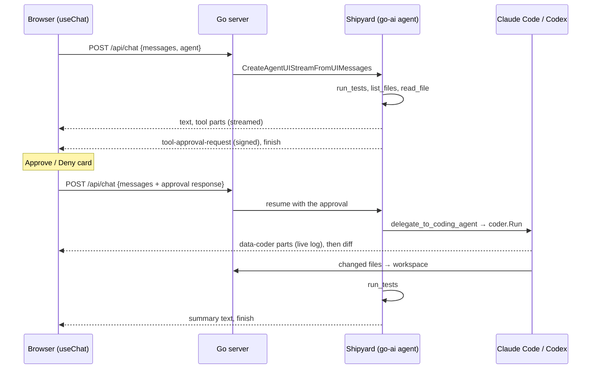

# Architecture

One user request takes two HTTP round trips. In the first, Shipyard investigates and stops at a tool call that needs approval. In the second, `useChat` sends the user's decision back, the server runs the approved tool, which drives Claude Code or Codex in a sandbox, and Shipyard finishes. Both responses stream to the browser as AI SDK UI message chunks over Server-Sent Events.

## Step by step

1. **Turn 1.** `handleChat` (`server/chat.go`) builds the agent for the chosen pairing and calls `agent.CreateAgentUIStreamFromUIMessages`, which validates the browser's messages, converts them for the model and runs the agent. The stream is merged into the response.
2. **Approval request.** The model calls `delegate_to_coding_agent`. The tool has `ToolApproval: true`, so the agent emits a signed `tool-approval-request` instead of running it, and the turn ends.
3. **The user decides.** `DelegatePart` (`web/components/ToolPart.tsx`) shows Approve and Deny. The answer goes back in turn 2. Signing, verification and the client side are in [protocol.md](protocol.md#approval-round-trip).
4. **Turn 2.** The same endpoint runs again. The agent runs the approved tool before calling the model.
5. **The coding agent works.** The tool calls `coder.Run` (`server/coder.go`), which streams the coding agent's activity as a `data-coder` part. When it finishes, the changed files are copied into the workspace and the tool returns the summary and diff.
6. **Wrap-up.** The model calls `run_tests` to verify and writes a short summary.

If the user denies, the tool result is a denial, Shipyard says nothing changed, and the coding agent never starts.

## Where state lives

| State | Lives in | Lifetime |
| --- | --- | --- |
| Conversation | The browser (`useChat`), sent in full on every request | Until **Start over** or reload |
| The project being fixed | `.data/workspace` on the server | Until `POST /api/reset`, **Start over** or a server restart |
| Coding-agent sandbox | `.data/sandboxes/` | One `coder.Run` call; destroyed when it returns |
| Approval signing key | `config.ApprovalSecret` | The server process, or fixed with `TOOL_APPROVAL_SECRET` |

The server keeps no per-user session, but it does keep one shared workspace on disk and runs one coding session at a time (`coder.mu`). Run a single instance.

## Design choices

- **The frontend is stock `useChat`.** The server speaks the AI SDK UI message stream protocol, so the web app is ordinary AI SDK code.
- **Shipyard never edits code.** It investigates with read-only tools and delegates the change, which keeps the approval meaningful.
- **Progress is a data part.** Go tools can't stream partial results, so `coder.Run` writes a `data-coder` part through the request's stream writer, using the tool call ID as the part ID. Each write replaces the previous one in the UI. See [protocol.md](protocol.md#the-data-coder-part).
- **Files move through the sandbox API.** The runner seeds and reads back files with `SandboxSession` calls, not host paths, so the same code works with a remote sandbox.

Next: [server.md](server.md) or [web.md](web.md).
